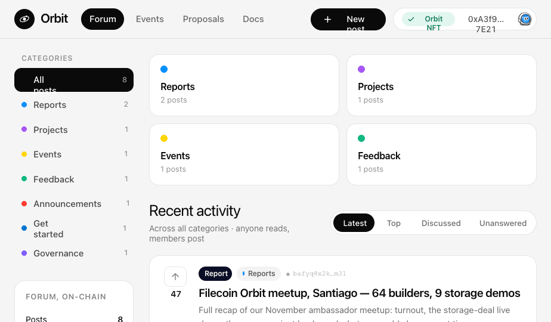
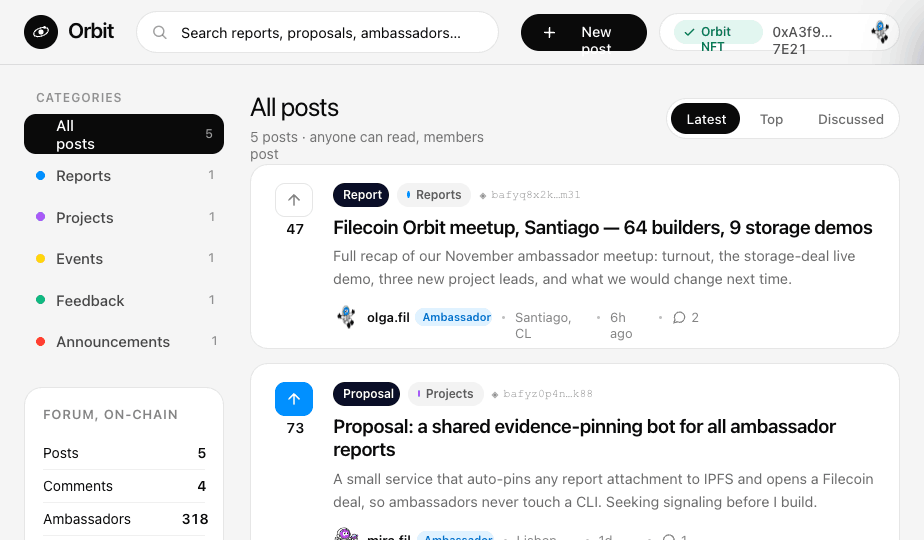
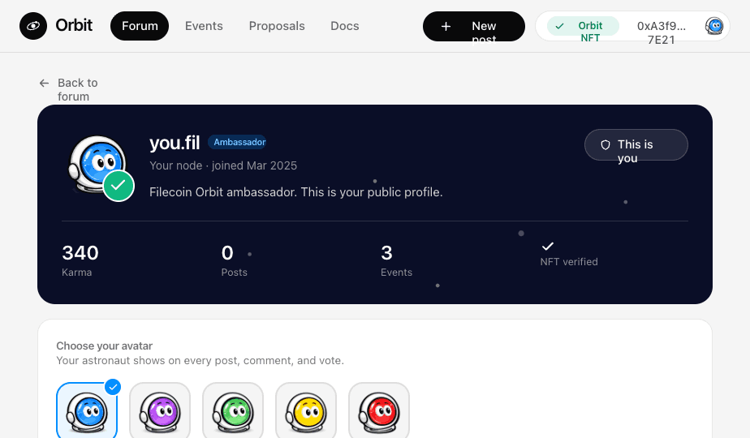
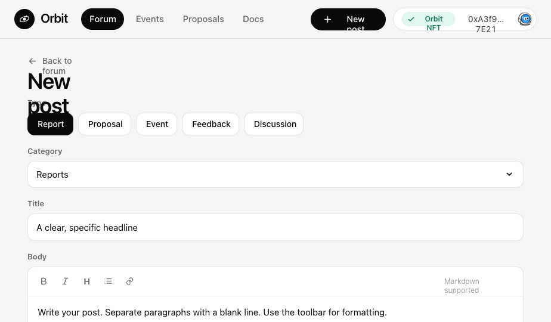
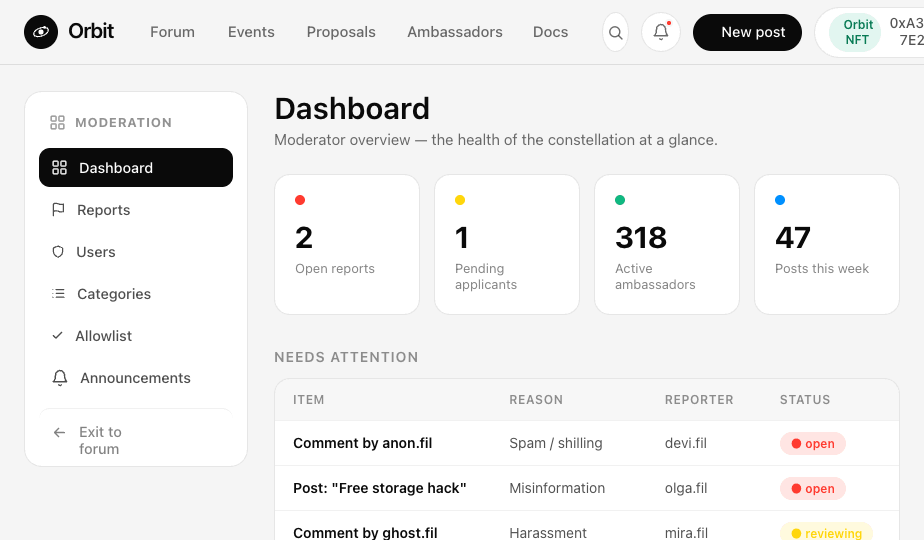
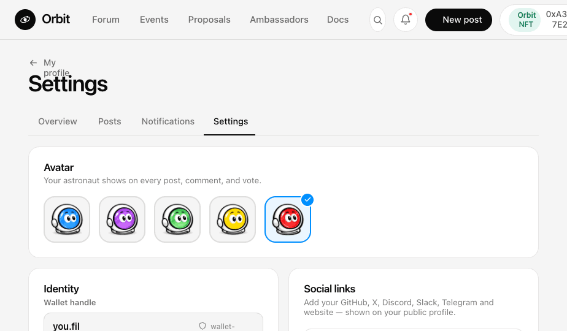

# Orbit — Filecoin Ambassador Forum

A governance and community forum for the Filecoin Ambassador Program. Posts are pinned to IPFS via Lighthouse and persisted on Filecoin. Wallet-gated participation with email magic-link as an alternative.



## Features

- **Forum** — categorized posts (Reports, Proposals, Events, Feedback, Governance) with voting, comments, reactions, and replies
- **Wallet auth** — connect with any EVM wallet via RainbowKit (Filecoin + Filecoin Calibration), or sign in with a magic-link email
- **IPFS pinning** — evidence files uploaded to Lighthouse, CID stored on-chain
- **Real-time** — post and comment updates via Supabase Realtime channels
- **Profiles** — karma, badges, follow/unfollow, bookmarks, avatar, bio
- **Events** — RSVP system backed by Supabase
- **Meetings** — live and scheduled calls with Jitsi Meet integration
- **Proposals** — governance proposals with voting status tracking
- **Admin panel** — moderation dashboard, user management, flag/report queue (real DB data)
- **i18n** — full Spanish / English toggle (Rioplatense Spanish)

## Stack

| Layer | Tech |
|-------|------|
| Frontend | React 18 + Vite |
| Wallet | Wagmi v2 + RainbowKit (Filecoin chains) |
| Backend | Supabase (Postgres + Auth + Realtime + RLS) |
| Storage | Lighthouse Web3 SDK (IPFS / Filecoin) |
| State | TanStack Query + local React state |

## Screenshots

| | |
|---|---|
|  |  |
|  |  |
|  |  |

## Setup

```bash
npm install
cp .env.example .env   # fill in the variables below
npm run dev
```

### Environment variables

```env
VITE_SUPABASE_URL=
VITE_SUPABASE_ANON_KEY=
VITE_WALLETCONNECT_PROJECT_ID=
VITE_LIGHTHOUSE_API_KEY=
```

`VITE_WALLETCONNECT_PROJECT_ID` is optional — the app falls back gracefully without it (wallet connections fail, but the UI won't crash).

### Supabase schema

Apply the SQL files in order:

```bash
supabase/schema.sql                    # posts, votes, comments
supabase/profiles-schema.sql           # public_profiles
supabase/public-profiles-schema.sql    # RLS for profiles
supabase/events-schema.sql             # events, rsvps
supabase/meetings-schema.sql           # meetings, meeting_attendees
supabase/notifications-schema.sql      # notifications
supabase/proposal-status-migration.sql # proposal status column
```

## Commands

```bash
npm run dev       # dev server → http://localhost:5173
npm run build     # production build → dist/
npm run preview   # serve dist/ locally
npm run lint      # ESLint
npx vitest run    # tests (single pass)
```

## Architecture

**Routing** — custom hash router in `src/App.jsx`. All navigation via `navTo(hash)`. No React Router.

**Auth** — `src/hooks/useAuth.js` unifies wallet auth (wagmi `useAccount`) and email auth (Supabase OTP). Identity is the wallet address or `email-prefix.fil`.

**Data** — three core hooks (`usePosts`, `useVotes`, `useComments`) own all Supabase operations. All live at App level, passed as props. No global state manager.

**Seed data** — `src/data/constants.js` and `src/data/seed.js` provide fallback data when Supabase tables are empty (useful for dev/mockup mode).

**CSS** — design tokens and components in `src/styles/orbit.css`; forum layout in `src/styles/forum.css`.

## License

MIT
